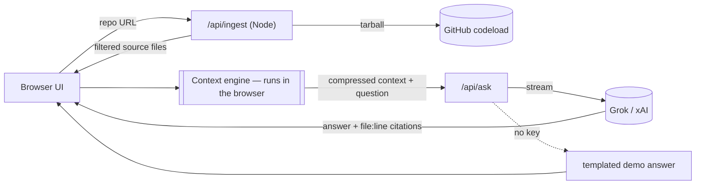
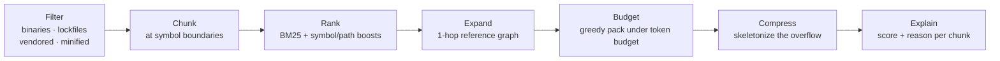

# RepoLens — Founding AI Engineer Assignment

**Repo:** https://github.com/Yuvraj235/repolens
**Live demo:** https://repolens-lime-zeta.vercel.app

> The live demo works with no setup — click "Try the bundled demo repo", or paste any public
> GitHub repo. If a Grok key is configured on the deployment you get real AI answers; otherwise it
> runs in demo mode where everything except the final sentence is still fully live.

---

## 1. What I built and why

I built **RepoLens**: a web app that takes a GitHub repo and answers questions about it, but the
actual product is the thing in the middle — a **context engine** that decides the *minimum* slice
of the codebase a given question needs, compresses it, and shows you the token savings.

I chose this on purpose. The assignment could have been a quiz app or a game, but I'm interviewing
for a founding AI engineer role on **Superbrain**, whose whole differentiator is a context engine
that "compresses and prioritizes code intelligence on the fly and cuts token usage 60–80%." So
rather than build something adjacent, I wanted to build the *hard part* — the exact competency the
role is about — and prove I understand why it matters.

The core bet behind the product: **the bottleneck in AI coding tools isn't the model, it's the
context.** Dumping a whole repo is expensive, slow, and actually makes answers worse (the signal
drowns). The interesting engineering is deciding what *not* to send. RepoLens makes that decision
visible and measurable.

Concretely, on `sindresorhus/ky` (~145k tokens of code) a focused question sends ~6k tokens of
context — a **~96% reduction** — and still cites exact `file:line` locations. That number is the
whole point, so I put it front and center.

## 2. How it works (30-second tour)

1. Paste a repo → the server downloads the tarball, filters junk (binaries, lockfiles, vendored
   dirs), and returns the source files.
2. The browser builds a structural index and, for each question, runs the context engine locally.
3. The selected + compressed context goes to Grok, which streams back an answer with citations.
4. The **Context Inspector** shows: full-repo tokens vs. tokens sent, % saved, and every chunk
   that was picked — with its score and a plain-English reason ("symbol name match: authGuard",
   "defines `Note`, referenced by store.ts"). Click any citation to jump to the code.

## 3. Architecture & key design decisions

**Stack:** Next.js (App Router) + TypeScript + Tailwind, deployed on Vercel. Answers come from
**Grok (xAI)** through its OpenAI-compatible endpoint.

The two API routes are stateless and thin. The heavy lifting — indexing, retrieval, compression —
happens client-side, so there's no server session or vector store to manage.

**The context engine (`lib/context-engine/`)** is the core IP and is deliberately simple:

- **Filter** → drop binaries, lockfiles, `node_modules`, minified bundles, oversized files.
- **Chunk** → split files at symbol boundaries (functions/classes/types) with per-language regex
  rules, fixed-window fallback otherwise. Each chunk carries a full form and a "skeleton"
  (signature only).
- **Rank** → BM25 over code-aware tokens + boosts for symbol-name and filename matches.
- **Expand** → a one-hop reference graph pulls in the *definitions* the top chunks depend on.
- **Budget + compress** → greedily pack the best chunks under a token budget; condense the rest to
  skeletons so the model still knows they exist.
- **Explain** → every selection comes out with a score and a human-readable reason.

I'll call out the decisions that actually mattered, because the "how you decide" part is what you
said you care about:

**No embeddings / no vector DB.** The obvious move for "chat with a repo" is RAG with embeddings.
I deliberately didn't. Two reasons: (1) xAI doesn't expose an embeddings API, so it would've meant
bolting on a second provider and infra; (2) more importantly, **structural + lexical selection is
a better fit for the pitch.** "Prioritize code intelligence on the fly" is about structure —
symbols, references, file layout — not fuzzy semantic similarity. Lexical + a reference graph is
fast, has zero infra, runs in the browser, and is *explainable*, which turned out to be the most
compelling part of the demo. If I needed semantic recall later I'd add embeddings as a *second*
signal, not the foundation.

**Run the engine in the browser; keep the server routes dumb.** The index is built client-side and
every question runs retrieval locally. The server only does two stateless things: fetch/parse a
tarball, and proxy the streaming answer. This dodged the whole serverless-state problem (Vercel
functions aren't sticky, so an in-memory index wouldn't survive between requests) without reaching
for a KV store. The tradeoff is a size cap on repos, which is fine for a demo and has an obvious
scale path.

**Keyless demo mode.** The retrieval and compression are pure computation — they need no API key.
Only the final natural-language sentence needs Grok. So the deployed link is meaningful to a
reviewer even with no key: they see the real engine work and the real savings, and the answer is a
templated summary of the selected context. This was a product decision, not a technical one — the
live link had to *demonstrate value on the first click*.

**Token counts are honest estimates.** xAI doesn't publish Grok's tokenizer, so I use
`gpt-tokenizer` as a consistent proxy and label it as an estimate. Both sides of the savings ratio
are measured the same way, so the comparison is fair even if the absolute number is approximate. I'd
rather show an honest estimate than a fake-precise one.

## 4. Decision-making log (things I changed my mind on)

- **The demo repo was too small at first.** My first bundled repo was ~2k tokens, so with a normal
  budget it nearly fit and the app showed only ~13% "saved" — which undersells the entire point. I
  rebuilt it as a realistic *layered* service (routes → services → repositories → store, ~5k
  tokens) so focused questions show ~60% on the demo and the reference-graph expansion has real
  chains to follow. The lesson: the demo has to make the value legible, and I had to notice the
  metric was lying about the product before a reviewer did.
- **Retrieval was weak until I added stemming + stopwords.** "How does *authentication* work" was
  matching junk words like "to"/"end" and missing the `auth` code entirely, because the query says
  "authentication" and the code says "auth". I added a 4-char prefix stem and a stopword filter;
  the same question then correctly surfaced the whole auth flow across five files. Small change,
  huge quality difference — and exactly the kind of unglamorous work a context engine lives on.
- **Dropped the Vercel AI SDK.** I started to use it, then switched to a plain `fetch` against the
  OpenAI-compatible endpoint. Fewer moving parts, no version-churn risk, and streaming SSE is easy
  to parse by hand. For a founding-stage codebase I'd rather own the ~40 lines than the dependency.

## 5. Product strategy — what I'd add next to Superbrain, and why

I installed Superbrain and studied how it actually works before answering, so I could avoid
proposing things it already ships. It's a terminal-native agent whose context engine —
**TokenFold** — maps a repo in seconds, keeps **persistent context** across sessions, and turns
issues into PRs behind an approval gate. So a "warm/persistent repo map" is *already done*; here's
what I'd build on top of it.

**Lead with what I built here: make TokenFold's decisions visible and steerable.** TokenFold is the
whole moat, but right now you get its *benefit* (60–80% fewer tokens, full-repo awareness) without
seeing *what it chose*. When an answer or an edit is wrong, you can't tell if it's a bad model or
bad context, and you can't correct it. I'd ship a first-class **Context Inspector**: for any agent
step, show the files/symbols TokenFold pulled in, what it dropped and why, and let the user
**pin, exclude, or add** context before the step runs — which is exactly what RepoLens's right
panel does. It compounds: visibility → trust → more usage → users correcting selections → the best
training signal you can get for the engine itself. For a product whose moat *is* the context
engine, making that engine legible is the highest-leverage thing you can build.

**A verification loop before the approval gate.** Superbrain already asks for approval before it
changes anything — good instinct. But approval is only as good as the reviewer's confidence, so run
the cheap checks (typecheck / affected tests / lints) on the *proposed diff* and show the result
inline, right next to the approve button. "Confidently wrong edits" are the #1 reason people stop
trusting agents; catching them automatically is what makes issue-to-PR safe to trust at scale —
worth more than a slightly smarter model.

**Team-level shared context.** Superbrain targets teams on big monorepos, so TokenFold shouldn't
just understand the repo — it should understand *this team's* conventions: past PRs, review
preferences, house patterns, the tribal knowledge that never lands in a README. Let the engine
learn and share that across the team so generated PRs come out in-style and need less
back-and-forth. That turns the context engine from a per-developer tool into a per-org asset, which
is where the enterprise value really compounds.

## 6. Product strategy — UI issues I dislike and how they annoy users

Framed for what Superbrain actually is — a terminal-native agent with IDE extensions and an
issue-to-PR flow:

- **Opaque context (the big one).** In a terminal you *really* can't see what the engine read —
  it's a text stream, not a panel — so when TokenFold picks the wrong context the user's only move
  is to rephrase and hope. It wastes turns and quietly erodes trust in the exact thing the product
  is selling. (RepoLens's Context Inspector is my answer to this.)
- **PR review in the wrong surface.** "Issue → production-ready PR" is a great promise, but the
  moment of truth is *reviewing* a multi-file generated PR, and a terminal (or a raw diff) is a bad
  place to do that. Reviewing 300 lines across 8 files with coarse accept/reject means people
  either rubber-stamp (dangerous) or bail (wasteful). It needs structured, per-file/per-hunk review
  with the agent's reasoning — and the context that grounded each change — attached.
- **All-or-nothing approval.** The safe-execution approval gate is the right instinct, but approving
  a whole batch in one keystroke is too coarse. Users want to accept the good changes and reject the
  sketchy ones without discarding the entire run.
- **Autonomous runs with no mid-flight steering.** A long issue-to-PR run you can only watch or
  hard-stop (losing all state) is stressful. Users want to *nudge* — "don't touch the auth module",
  "use the existing helper" — without killing the run.
- **Latency with no narration.** A bare terminal spinner tells you nothing. Even a truthful
  "reading 6 files via TokenFold, planning an edit to 2 of them" removes most of the anxiety; a
  spinner removes none of it.

The through-line: Superbrain — like most agent tools — is optimized for the *happy-path demo* and
under-invests in the *correction path*, i.e. what the user does when it's wrong, which is most of
the time in real work. That's where I'd spend the UI effort, and it's why RepoLens is built
entirely around showing its work.

## 7. With more time

Tree-sitter chunking (more accurate than my regex rules), server-side indexing + KV cache to lift
the repo-size cap, semantic retrieval as a second ranking signal, a "diff view" for asking about a
PR instead of a whole repo, and shareable result links.

## 8. Honest limitations

Chunking is heuristic, not a real parser, so a few exotic files fall back to fixed windows. Repos
are capped because indexing runs client-side. Token numbers are estimates. Demo mode's final
sentence is templated, not model-generated. None of these change the thing the project is meant to
demonstrate — that deciding *what not to send* is the real work, and that it can be made fast,
measurable, and transparent.
